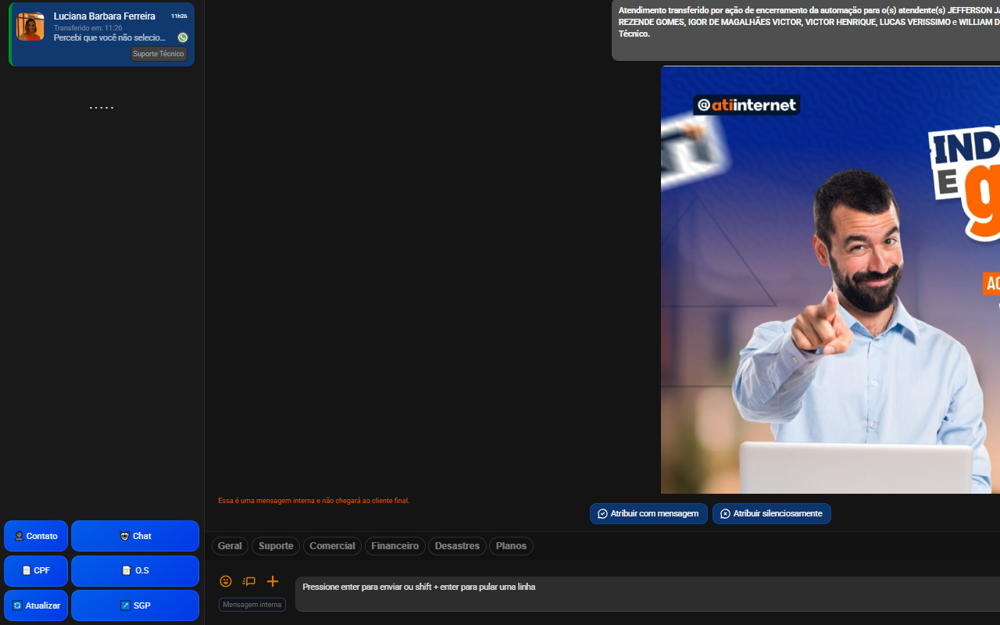
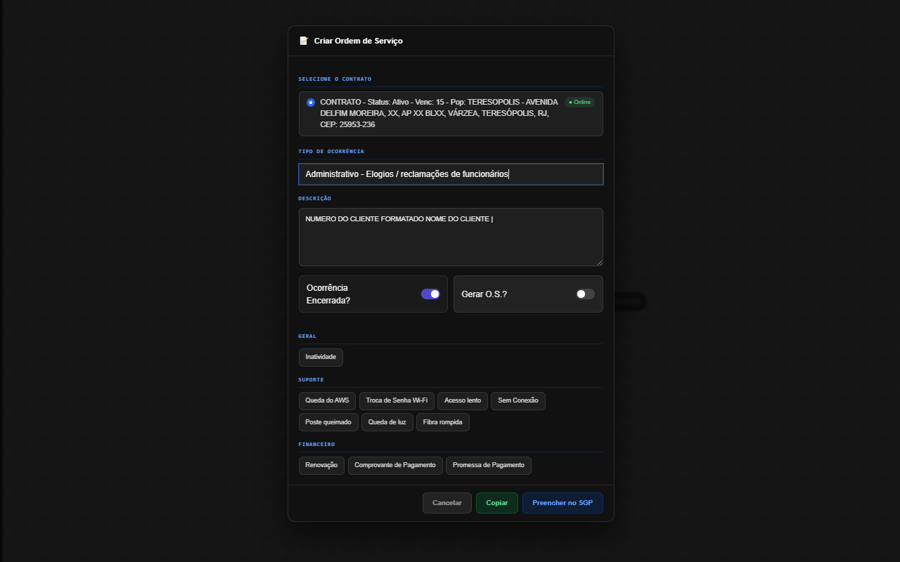

<div align="center">


# ATI — Auxiliar de Atendimentos

**Extensão Chrome para otimizar o atendimento via ChatMix, integrada ao SGP.**

[](https://chromewebstore.google.com/detail/ati-auxiliar-de-atendimen/mlgmmjacfbnkolflbankfiackpcnmckl)
[](https://chromewebstore.google.com/detail/ati-auxiliar-de-atendimen/mlgmmjacfbnkolflbankfiackpcnmckl)
[](https://developer.chrome.com/docs/extensions/mv3/)
[](https://www.typescriptlang.org/)
[](https://react.dev/)

[🔧 Central de Configuração](https://vituali.github.io/ATI) · [📦 Chrome Web Store](https://chromewebstore.google.com/detail/ati-auxiliar-de-atendimen/mlgmmjacfbnkolflbankfiackpcnmckl) · [📋 Changelog](#-changelog)

</div>

---

## 📸 Screenshots

<div align="center">

| Sidebar com Quick Replies e Botões                                                                                | Modal de Criar O.S                                                                                                        |
| ----------------------------------------------------------------------------------------------------------------- | ------------------------------------------------------------------------------------------------------------------------- |
|  |  |

</div>

---

## ✨ Funcionalidades

### 🔘 Botões na Sidebar do ChatMix

| Botão            | Função                                              |
| ---------------- | --------------------------------------------------- |
| 👤 **Contato**   | Copia nome e telefone formatados                    |
| 🤖 **Chat**      | Gera prompt inteligente para IA com histórico limpo |
| 📄 **CPF**       | Copia CPF/CNPJ detectado nas mensagens              |
| 📝 **O.S**       | Abre modal de abertura de ocorrência no SGP         |
| 🔄 **Atualizar** | Limpa cache e recarrega dados do cliente            |
| ↗️ **SGP**       | Abre ficha do cliente diretamente no SGP            |

### 📝 Modal de O.S

- Seleção de contrato com **status Online/Offline em tempo real**
- Seleção de tipo de ocorrência com busca
- Modelos de O.S personalizados por atendente
- Preenchimento automático do formulário no SGP
- **Rascunho automático** — salva o texto ao digitar e restaura ao reabrir
- Limpo automaticamente ao encerrar o atendimento

### ⚡ Quick Replies

- Respostas rápidas categorizadas injetadas acima do campo de mensagem
- Dois níveis: categorias → respostas
- Inserção com um clique no campo de texto
- Cache em memória — **uma única leitura do Firebase por sessão**

### 🤖 Prompt para IA

- Histórico limpo: remove mensagens de automação, transferências e menus de bot
- Identifica mensagens do cliente vs atendente pelo DOM
- Pronto para colar no ChatGPT, Claude ou qualquer IA

### 🔐 Autenticação

- Login próprio integrado ao Firebase por atendente
- Sessão persistida no `chrome.storage.local`
- Controle de acesso por status (`ativo` / bloqueado)

---

## 🏗️ Arquitetura

```
src/
├── background/                  # Service Worker (lógica de rede e CORS)
│   ├── index.ts                 # Entry point — listener de mensagens
│   ├── firebase.ts              # Auth, templates e quick replies
│   └── sgp/
│       ├── constants.ts         # URLs, TTLs e interfaces
│       ├── cache.ts             # Cache do formulário (máx. 50 entradas)
│       ├── auth.ts              # Login SGP com cache de sessão
│       ├── search.ts            # Busca de clientes (CPF, nome, telefone)
│       ├── contracts.ts         # Contratos + status online/offline
│       └── occurrence.ts        # Formulário, ocorrências e abertura de abas
│
├── contentScript/
│   └── chatmix/
│       ├── index.ts             # Entry point — botões, observer, init
│       ├── state.ts             # Estado global, seletores, debug
│       ├── helpers.ts           # CPF/CNPJ, formatação, setNativeValue
│       ├── getClientData.ts     # Extração de dados do DOM
│       ├── buildAIPrompt.ts     # Gerador de prompt para IA
│       ├── Quickreply.ts        # Quick replies com cache em memória
│       ├── style.css
│       ├── auth/
│       │   ├── firebase.ts
│       │   ├── session.ts
│       │   ├── login.ts
│       │   ├── loginModal.ts
│       │   └── login.css
│       └── os/
│           ├── osModal.ts       # Modal de O.S completo
│           ├── osDraft.ts       # Rascunho por chatId no sessionStorage
│           └── osModal.css
│
├── popup/
│   ├── popup.html
│   ├── main.tsx
│   ├── Popup.tsx
│   └── Popup.css
│
└── manifest.ts
```

---

## 🛠️ Stack

- **React 18** + **TypeScript** — Popup
- **Vite** — Build com Manifest V3
- **Firebase Realtime Database** — Modelos, quick replies e autenticação
- **Chrome Extensions API** — Storage, Tabs, SidePanel
- **MutationObserver** com debounce — Detecção de troca de atendimento

---

## 🚀 Desenvolvimento

### Pré-requisitos

- Node.js 18+
- npm ou yarn

### Instalação

```bash
git clone https://github.com/Vituali/Chrome-Extension-ATI-V2.git
cd Chrome-Extension-ATI-V2
npm install
```

### Build

```bash
# Build com watch (desenvolvimento)
npm run build -- --watch

# Build de produção
npm run build

# Build de envio para chrome web
npm run zip
```

### Carregar no Chrome

1. Acesse `chrome://extensions/`
2. Ative o **Modo desenvolvedor**
3. Clique em **Carregar sem compactação**
4. Selecione a pasta `dist/`

---

## ⚙️ Configuração

A central de configuração da extensão está disponível em **[vituali.github.io/ATI](https://vituali.github.io/ATI)**, onde administradores podem:

- 👥 Gerenciar atendentes (criar, bloquear, definir roles)
- 📋 Criar e editar **modelos de O.S** por atendente
- ⚡ Criar e editar **quick replies** com categorias e subcategorias

### Estrutura do Firebase

```
admins/{uid}                     → true
atendentes/{username}            → { email, nomeCompleto, role, uid, status }
modelos_os/{username}/{id}       → { id, title, text, category, occurrenceTypeId }
respostas/{username}/[]          → { category, subCategory, text, title }
```

---

## 📋 Changelog

### v2.0.4

- ✅ Status **Online/Offline** dos contratos no modal de O.S
- ✅ Background desmembrado em módulos (`firebase`, `sgp/auth`, `sgp/contracts`, etc.)
- ✅ Rascunho automático da O.S por atendimento (`sessionStorage`)
- ✅ Cache de quick replies em memória — uma leitura Firebase por sessão
- ✅ Debounce no MutationObserver — compatibilidade com Vue virtual scroller
- ✅ Proteção contra inits e carregamentos simultâneos
- ✅ Limite de 50 entradas no cache do formulário SGP
- ✅ AbortSignal.timeout em todas as fetches do SGP
- ✅ Prompt para IA com histórico limpo (remove automação/transferências)
- ✅ Toggle switches no modal de O.S

### v2.0.0

- 🎉 Reescrita completa — React + TypeScript + Manifest V3
- 🔐 Sistema de login próprio com Firebase
- 📝 Modal de O.S com preenchimento automático no SGP
- ⚡ Quick replies categorizados
- 🤖 Detecção automática de troca de atendimento

---

## 👤 Autor

Desenvolvido por **Vituali** para uso interno na **ATI Internet**.

---

<div align="center">
<sub>Disponível na <a href="https://chromewebstore.google.com/detail/ati-auxiliar-de-atendimen/mlgmmjacfbnkolflbankfiackpcnmckl">Chrome Web Store</a></sub>
</div>
